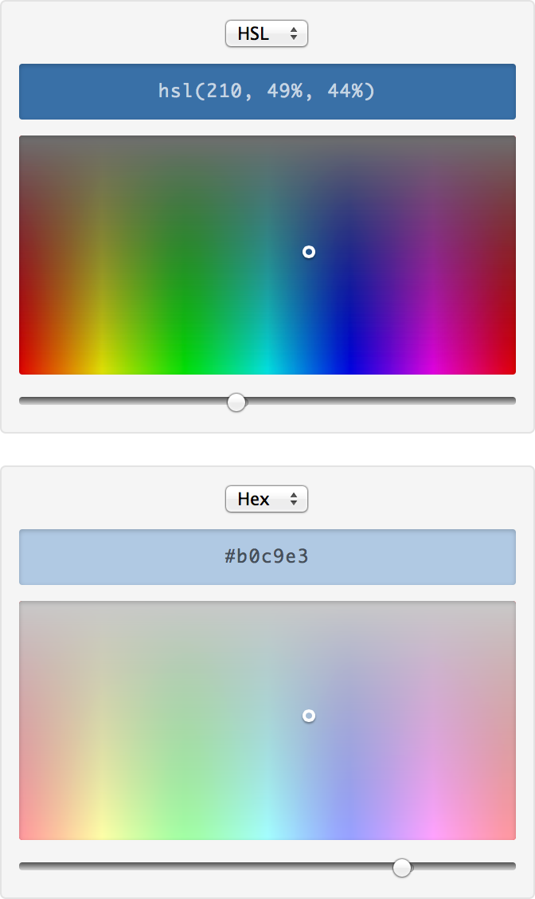

# Purty Picker

A super lightweight visual HSL, RGB and hex color picker with a responsive, touch-friendly and customizable UI. Compatible with [jQuery](https://github.com/jquery/jquery) or [Zepto](https://github.com/madrobby/zepto).

## Screenshots

To try it out [Download the project ZIP](https://github.com/jaydenseric/purty-picker/archive/master.zip) and open `demo.html` in your browser.

## Features

* Small file-size (~4kb minified) with < 300 lines of source JS ([Spectrum](https://github.com/bgrins/spectrum/blob/master/spectrum.js) exceeds 2000 lines).
* Compact and simple design with native controls. The color input also serves as a preview (text color automatically inverts for legibility).
* Responsive. Everything is percent and not pixel based.
* HDPI "Retina" quality CSS based UI.
* Touch friendly.
* Color picker markup is your own and not JS generated.
* Semantic class and file names (e.g. using `.color-picker` and not `.purty-picker`).
* CSS is split into core and customization, allowing you to easily get started on your own skin.
* Simple enough to reverse-engineer and extend with your own features.
* Inexpensive and automatic initialization. Multiple pickers may be used on a page.

## Usage

Add the `.color-picker` markup, making sure to:

* Set a default `.color` input value (CSS valid HSL, RGB or hex).
* Mark the relevant color `.format` option as `selected`.

Include [color-picker.js](https://github.com/jaydenseric/purty-picker/blob/master/color-picker.js) on the page for it to automatically find and enable every `.color-picker`.

Take a look at [demo.html](https://github.com/jaydenseric/purty-picker/blob/master/demo.html) to see example markup for the default skin in [color-picker.css](https://github.com/jaydenseric/purty-picker/blob/master/color-picker.css).

### Customization

Reorder components or add markup to your heart's content. Just keep the core classnames on the core components and don't remove the required child `div` of `.spectrum` containing `.pin` as it serves as the luminosity filter.

The CSS is split into core and customization; use the default skin in the customization section as a custom skin boilerplate.

## Browser Support

For modern browsers (IE10+), mostly due to the use of CSS3 linear gradients. Support for older browsers could be possible with a few modifications.

## Dependencies

Requires [jQuery](https://github.com/jquery/jquery) or [Zepto](https://github.com/madrobby/zepto) with core and event modules.

## Todo

* Validation for incorrect color input values.
* On-demand initialization for dynamically inserted color pickers.
